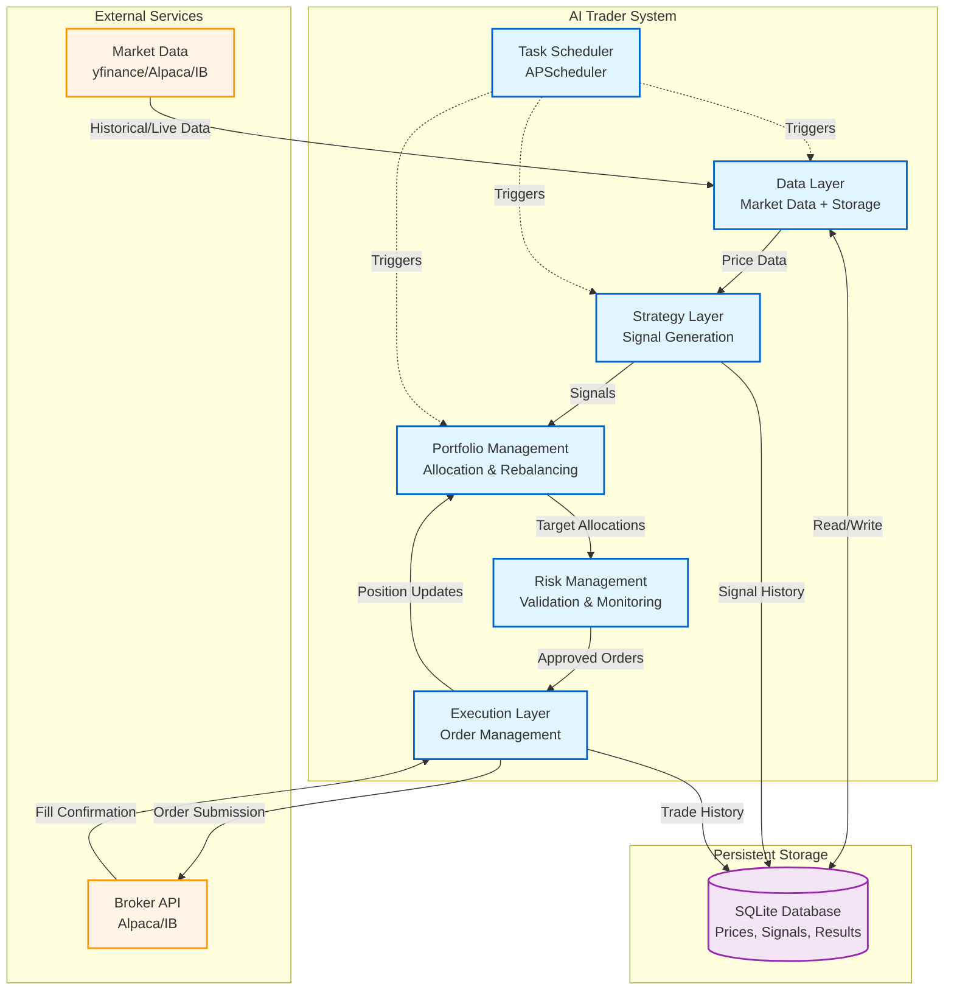
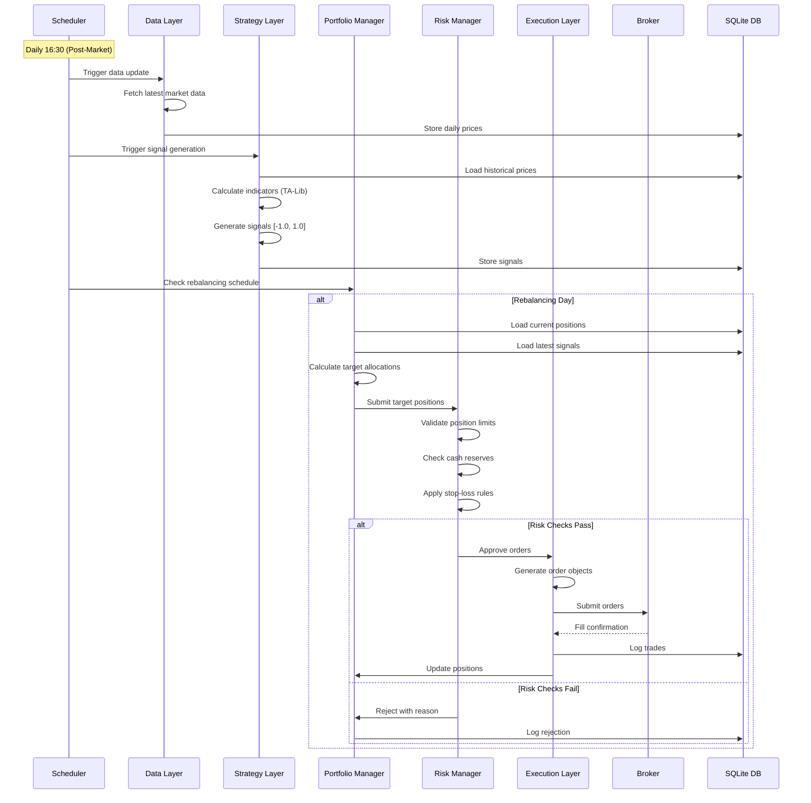
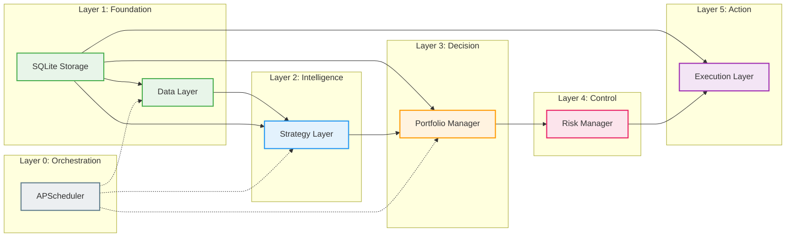
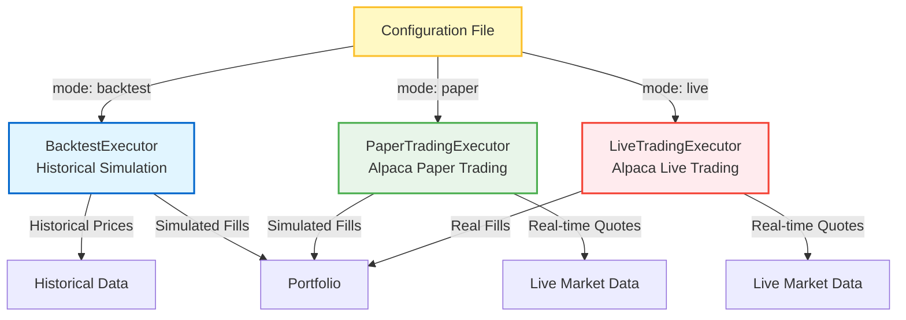
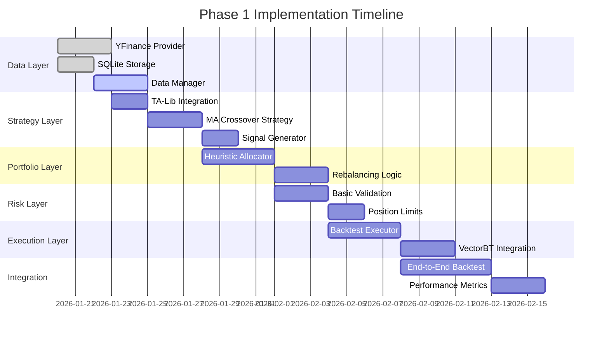
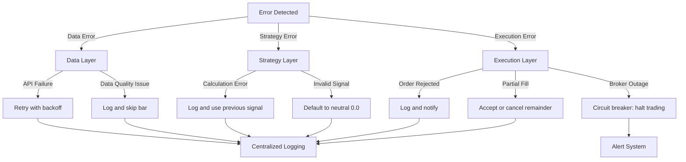

# Architecture Overview

## System Architecture

The AI Trader system follows a **layered architecture** with clear separation of concerns. Each layer communicates through well-defined interfaces, enabling independent development and testing.

### High-Level Layer Diagram



## Data Flow

### Daily Trading Workflow



## Module Dependencies

### Layer Dependency Graph



## Core Interfaces

### 1. Data Provider Interface

```python
class DataProvider(ABC):
    """Abstract interface for market data providers."""

    @abstractmethod
    def get_historical_bars(
        self,
        symbols: List[str],
        start_date: datetime,
        end_date: datetime,
        timeframe: str = "1D"
    ) -> pd.DataFrame:
        """Fetch historical OHLCV data."""
        pass

    @abstractmethod
    def get_latest_quote(self, symbols: List[str]) -> pd.DataFrame:
        """Get latest quotes for symbols."""
        pass
```

**Implementations**: `YFinanceProvider`, `AlpacaProvider`, `IBProvider`

### 2. Strategy Interface

```python
class Strategy(ABC):
    """Abstract base for trading strategies."""

    @abstractmethod
    def generate_signals(
        self,
        price_data: pd.DataFrame,
        lookback_days: int = 252
    ) -> Dict[str, float]:
        """
        Generate trading signals.

        Returns:
            Dict mapping symbol -> signal strength [-1.0, 1.0]
            -1.0 = Strong Sell, 0.0 = Neutral, +1.0 = Strong Buy
        """
        pass
```

**Implementations**: `MACrossoverStrategy`, `MomentumStrategy`, `MultiFactorStrategy`

### 3. Portfolio Manager Interface

```python
class PortfolioManager(ABC):
    """Abstract interface for portfolio allocation."""

    @abstractmethod
    def calculate_target_positions(
        self,
        signals: Dict[str, float],
        current_positions: Dict[str, int],
        account_value: float
    ) -> Dict[str, int]:
        """
        Convert signals to target share quantities.

        Returns:
            Dict mapping symbol -> target share quantity
        """
        pass
```

**Implementations**: `HeuristicAllocator`, `RiskParityAllocator`, `BlackLittermanAllocator`

### 4. Risk Manager Interface

```python
class RiskManager(ABC):
    """Abstract interface for risk control."""

    @abstractmethod
    def validate_orders(
        self,
        proposed_orders: List[Order],
        current_positions: Dict[str, Position],
        account_info: AccountInfo
    ) -> Tuple[List[Order], List[Order]]:
        """
        Validate proposed orders against risk limits.

        Returns:
            (approved_orders, rejected_orders)
        """
        pass
```

**Implementations**: `BasicRiskManager`, `DynamicRiskManager`, `AdvancedRiskManager`

### 5. Order Executor Interface

```python
class OrderExecutor(ABC):
    """Abstract interface for order execution."""

    @abstractmethod
    def submit_orders(self, orders: List[Order]) -> List[OrderStatus]:
        """Submit orders for execution."""
        pass

    @abstractmethod
    def get_positions(self) -> Dict[str, Position]:
        """Get current positions."""
        pass
```

**Implementations**: `BacktestExecutor`, `PaperTradingExecutor`, `LiveTradingExecutor`

## Execution Modes

The system supports three execution modes through abstraction:



**Mode Switching**: Configuration-driven, no code changes required.

## Phase Implementation Roadmap

### Phase 1: Backtesting Foundation (Current Focus)



**Phase 1 Deliverables**:
- Complete backtesting system with historical data
- Simple MA crossover strategy
- Heuristic portfolio allocation
- Basic risk validation
- Performance reporting

### Phase 2: Paper Trading (Post Phase 1 Validation)

**Focus**:
- Alpaca Paper Trading API integration
- Real-time data streaming
- Dynamic stop-loss/take-profit
- Enhanced portfolio allocation (risk-adjusted)

### Phase 3: Production (Post Paper Trading Validation)

**Focus**:
- Alpaca Live Trading integration
- Advanced risk management (VaR, drawdown protection)
- Portfolio optimization (Black-Litterman, Markowitz)
- QuantStats reporting
- Production monitoring and alerts

## Configuration Management

### Centralized Configuration

All system behavior is controlled through a single YAML configuration file:

```yaml
# config/config.yaml

# Execution Mode
execution:
  mode: "backtest"  # Options: backtest, paper, live
  provider: "alpaca"

# Data Provider
data:
  provider: "yfinance"  # Options: yfinance, alpaca, ib
  storage: "sqlite"
  db_path: "data/market_data.db"

# Strategy
strategy:
  type: "ma_crossover"
  parameters:
    fast_period: 50
    slow_period: 200
    universe: ["AAPL", "MSFT", "GOOGL", "AMZN", "NVDA"]

# Portfolio Management
portfolio:
  allocator: "heuristic"
  max_positions: 10
  cash_reserve: 0.05  # 5% cash reserve

# Risk Management
risk:
  max_position_size: 0.20  # 20% max per position
  max_total_exposure: 0.95  # 95% max total exposure
  stop_loss_pct: 0.10  # 10% stop-loss

# Scheduling
scheduling:
  data_update_time: "16:30"  # Daily post-market
  rebalance_frequency: "weekly"  # Options: daily, weekly, monthly
```

**Benefits**:
- Single source of truth
- Environment-specific configs (dev, staging, prod)
- No code changes for parameter tuning
- Easy A/B testing of strategies

## Technology Stack Summary

| Layer | Component | Technology |
|-------|-----------|------------|
| **Data** | Market Data | yfinance → Alpaca → IB |
| **Data** | Storage | SQLite + Pandas |
| **Strategy** | Indicators | TA-Lib (primary), pandas-ta (supplement) |
| **Strategy** | Framework | Multi-Factor Portfolio Strategy |
| **Portfolio** | Allocation | Custom (Phase 1) → PyPortfolioOpt (Phase 2-3) |
| **Risk** | Validation | Custom Rules |
| **Risk** | Analytics | QuantStats (Phase 3) |
| **Execution** | Backtesting | VectorBT |
| **Execution** | Paper Trading | Alpaca Paper API |
| **Execution** | Live Trading | Alpaca Live API |
| **Orchestration** | Scheduling | APScheduler |

## Design Principles

1. **Separation of Concerns**: Each layer has a single, well-defined responsibility
2. **Interface Abstraction**: All external dependencies are abstracted behind interfaces
3. **Configuration over Code**: Behavior controlled through configuration files
4. **Progressive Enhancement**: Start simple (Phase 1), add complexity as validated
5. **Data Integrity**: All trades, signals, and results are logged to SQLite
6. **Testability**: Each layer can be tested independently with mocks
7. **Performance**: Leverage compiled libraries (TA-Lib, NumPy, VectorBT) for speed

## Key Architectural Decisions

### 1. Why Layered Architecture?

- **Testability**: Each layer can be unit tested independently
- **Replaceability**: Swap implementations without affecting other layers
- **Clear Ownership**: Each layer has a single responsibility
- **Progressive Development**: Build and validate layer by layer

### 2. Why SQLite for Phase 1?

- Zero configuration, immediate productivity
- Sufficient for daily data (millions of rows)
- Audit trail for all trading decisions
- Easy migration to PostgreSQL if needed

### 3. Why VectorBT for Backtesting?

- 100-1000x faster than event-driven frameworks
- Multi-factor strategies require testing many parameter combinations
- Modern Python, excellent Pandas integration

### 4. Why Configuration-Driven Execution?

- Switch between backtest/paper/live without code changes
- Environment-specific configurations (dev/staging/prod)
- Easy parameter tuning and A/B testing

### 5. Why Independent Risk Layer?

- Strategy Layer focuses on signal generation (what to buy/sell)
- Risk Layer enforces limits (how much, when to exit)
- Separation prevents strategies from bypassing risk controls

## Error Handling and Resilience

### Error Handling Strategy



### Circuit Breakers

- **Data Layer**: Max 3 retries with exponential backoff
- **Execution Layer**: Halt trading after 5 consecutive order rejections
- **Risk Layer**: Emergency liquidation if drawdown > 20%

## Monitoring and Observability

### Key Metrics (Phase 3)

- **Performance**: Sharpe Ratio, Sortino Ratio, Max Drawdown
- **System Health**: API latency, order fill rate, data freshness
- **Risk Metrics**: VaR, CVaR, position concentration
- **Trading Activity**: Daily PnL, trade count, turnover

### Logging Strategy

```python
# Structured logging for all layers
logger.info("signal_generated", extra={
    "symbol": "AAPL",
    "signal": 0.75,
    "strategy": "ma_crossover",
    "timestamp": datetime.now().isoformat()
})
```

## Related Documents

- [tech-stack.md](tech-stack.md) - Technology decisions and rationale
- [data-layer-design.md](data-layer-design.md) - Data acquisition and storage
- [strategy-layer-design.md](strategy-layer-design.md) - Strategy framework
- [portfolio-management-design.md](portfolio-management-design.md) - Portfolio allocation
- [risk-management-design.md](risk-management-design.md) - Risk control
- [execution-layer-design.md](execution-layer-design.md) - Order execution
- [development-guidelines.md](development-guidelines.md) - Coding standards (TBD)
