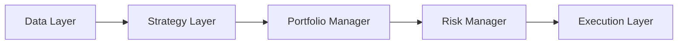
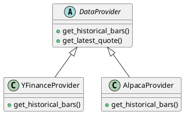
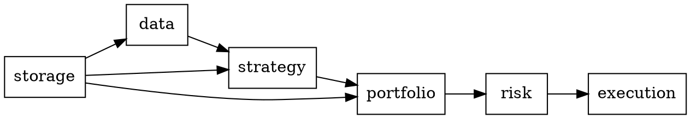
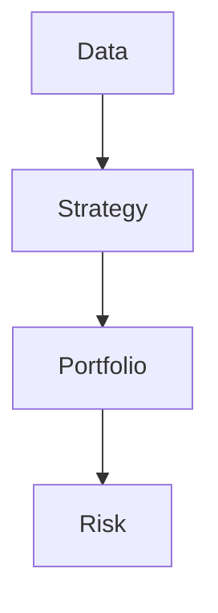

# Development Guidelines

## Overview

This document defines coding standards, project structure, and development practices for the AI Trader project. These guidelines ensure consistency, maintainability, and code quality throughout the multi-month development process.

## Project Structure

```
ai-trader/
├── agent/                      # Design documents and context (this directory)
│   ├── README.md
│   ├── architecture-overview.md
│   ├── tech-stack.md
│   ├── data-layer-design.md
│   ├── strategy-layer-design.md
│   ├── portfolio-management-design.md
│   ├── risk-management-design.md
│   ├── execution-layer-design.md
│   └── development-guidelines.md
│
├── src/                        # Source code
│   ├── api/                    # User-friendly Python APIs
│   │   ├── __init__.py
│   │   ├── data_api.py         # Data access API
│   │   ├── strategy_api.py     # Strategy testing API
│   │   └── portfolio_api.py    # Portfolio analysis API
│   │
│   ├── visualization/          # Visualization and reporting
│   │   ├── __init__.py
│   │   ├── charts.py           # Plotting functions (matplotlib/plotly)
│   │   └── reports.py          # Report generation
│   │
│   ├── data/                   # Data Layer
│   │   ├── __init__.py
│   │   ├── providers/          # Data provider implementations
│   │   │   ├── __init__.py
│   │   │   ├── base.py         # Abstract DataProvider
│   │   │   ├── yfinance_provider.py
│   │   │   ├── alpaca_provider.py
│   │   │   └── ib_provider.py
│   │   └── storage/            # Data storage
│   │       ├── __init__.py
│   │       ├── database.py     # SQLite manager
│   │       └── schema.sql      # Database schema
│   │
│   ├── strategy/               # Strategy Layer
│   │   ├── __init__.py
│   │   ├── base.py             # Abstract Strategy
│   │   ├── indicators/         # Technical indicators
│   │   │   ├── __init__.py
│   │   │   └── talib_wrapper.py
│   │   ├── ma_crossover.py     # MA Crossover strategy
│   │   ├── momentum.py         # Momentum strategy
│   │   └── multi_factor.py     # Multi-factor strategy
│   │
│   ├── portfolio/              # Portfolio Management Layer
│   │   ├── __init__.py
│   │   ├── base.py             # Abstract PortfolioManager
│   │   ├── allocators/
│   │   │   ├── __init__.py
│   │   │   ├── heuristic.py    # Phase 1: Simple allocation
│   │   │   ├── risk_parity.py  # Phase 2: Risk parity
│   │   │   └── black_litterman.py  # Phase 3: Optimization
│   │   └── rebalancer.py       # Rebalancing logic
│   │
│   ├── risk/                   # Risk Management Layer
│   │   ├── __init__.py
│   │   ├── base.py             # Abstract RiskManager
│   │   ├── validators/
│   │   │   ├── __init__.py
│   │   │   ├── position_limits.py
│   │   │   ├── cash_reserve.py
│   │   │   └── stop_loss.py
│   │   └── metrics.py          # Risk metrics calculation
│   │
│   ├── execution/              # Execution Layer
│   │   ├── __init__.py
│   │   ├── base.py             # Abstract OrderExecutor
│   │   ├── backtest_executor.py
│   │   ├── paper_executor.py   # Alpaca paper trading
│   │   ├── live_executor.py    # Alpaca live trading
│   │   └── order.py            # Order models
│   │
│   ├── orchestration/          # System orchestration
│   │   ├── __init__.py
│   │   ├── scheduler.py        # APScheduler integration
│   │   └── workflow.py         # Daily trading workflow
│   │
│   └── utils/                  # Shared utilities
│       ├── __init__.py
│       ├── config.py           # Configuration loader
│       ├── logging.py          # Logging setup
│       └── types.py            # Common type definitions
│
├── config/                     # Configuration files
│   ├── config.yaml             # Main configuration
│   ├── config.dev.yaml         # Development overrides
│   ├── config.staging.yaml     # Staging overrides
│   └── config.prod.yaml        # Production overrides
│
├── data/                       # Data storage
│   ├── market_data.db          # SQLite database (gitignored)
│   └── .gitkeep
│
├── tests/                      # Test suite
│   ├── unit/                   # Unit tests (per layer)
│   │   ├── test_data/
│   │   ├── test_strategy/
│   │   ├── test_portfolio/
│   │   ├── test_risk/
│   │   └── test_execution/
│   ├── integration/            # Integration tests
│   └── fixtures/               # Test fixtures and mock data
│
├── notebooks/                  # Jupyter notebooks (analysis, prototyping)
│   ├── 01_data_exploration.ipynb
│   ├── 02_strategy_development.ipynb
│   ├── 03_portfolio_analysis.ipynb
│   └── 04_backtest_analysis.ipynb
│
├── scripts/                    # Utility scripts and CLI tools
│   ├── view_data.py            # Interactive data viewer CLI
│   ├── test_strategy.py        # Strategy testing CLI
│   ├── view_portfolio.py       # Portfolio viewer CLI
│   ├── shell.py                # Interactive Python shell
│   ├── backtest.py             # Run backtest
│   ├── paper_trade.py          # Start paper trading
│   └── data_download.py        # Bulk data download
│
├── docs/                       # Additional documentation
│   └── .gitkeep
│
├── .devcontainer/              # VS Code DevContainer config
│   └── devcontainer.json
│
├── .gitignore
├── .pylintrc                   # Pylint configuration
├── pyproject.toml              # Black + tool configuration
├── requirements.txt            # Python dependencies
├── requirements-dev.txt        # Development dependencies
├── CLAUDE.md                   # Claude Code instructions
└── README.md                   # Project README
```

## Python Coding Standards

### General Principles

1. **Follow PEP 8**: Standard Python style guide
2. **Type Hints**: Use type annotations for all function signatures
3. **Docstrings**: Google-style docstrings for all public functions/classes
4. **Black Formatting**: Auto-format on save (88 character line length)
5. **Max Line Length**: 120 characters (soft limit, 88 preferred)

### Code Formatting

**Formatter**: Black (default settings, 88 character line length)

```python
# Good: Black-formatted code
def calculate_signals(
    price_data: pd.DataFrame,
    fast_period: int = 50,
    slow_period: int = 200
) -> Dict[str, float]:
    """
    Calculate MA crossover signals.

    Args:
        price_data: OHLCV DataFrame with symbol column
        fast_period: Fast moving average period
        slow_period: Slow moving average period

    Returns:
        Dict mapping symbol to signal strength [-1.0, 1.0]
    """
    signals = {}
    # Implementation...
    return signals
```

### Type Hints

**Always use type hints** for function signatures:

```python
from typing import Dict, List, Optional, Tuple
import pandas as pd
from datetime import datetime

def get_historical_data(
    symbols: List[str],
    start_date: datetime,
    end_date: datetime,
    provider: Optional[str] = None
) -> pd.DataFrame:
    """Fetch historical price data."""
    pass

def validate_orders(
    orders: List[Order],
    positions: Dict[str, Position]
) -> Tuple[List[Order], List[Order]]:
    """Returns (approved_orders, rejected_orders)."""
    pass
```

### Docstring Style

**Use Google-style docstrings**:

```python
class Strategy(ABC):
    """Abstract base class for trading strategies.

    Strategies generate trading signals based on market data and technical
    indicators. Signals are normalized to [-1.0, 1.0] range where:
    - -1.0: Strong sell signal
    -  0.0: Neutral (no position)
    - +1.0: Strong buy signal

    Attributes:
        name: Strategy identifier
        parameters: Configuration parameters

    Example:
        >>> strategy = MACrossoverStrategy(fast=50, slow=200)
        >>> signals = strategy.generate_signals(price_data)
        >>> print(signals["AAPL"])  # Output: 0.75
    """

    def generate_signals(
        self,
        price_data: pd.DataFrame,
        lookback_days: int = 252
    ) -> Dict[str, float]:
        """
        Generate trading signals for symbols in price_data.

        Args:
            price_data: DataFrame with columns [symbol, date, open, high, low, close, volume]
            lookback_days: Number of historical days to use for calculation

        Returns:
            Dict mapping symbol to signal strength [-1.0, 1.0]

        Raises:
            ValueError: If price_data is missing required columns
            CalculationError: If indicator calculation fails
        """
        pass
```

### Import Organization

**Order imports** in this sequence:

1. Standard library imports
2. Third-party library imports
3. Local application imports

```python
# Standard library
import sqlite3
from datetime import datetime, timedelta
from typing import Dict, List, Optional

# Third-party
import pandas as pd
import numpy as np
import talib

# Local
from src.data.providers.base import DataProvider
from src.strategy.base import Strategy
from src.utils.config import load_config
```

### Naming Conventions

```python
# Classes: PascalCase
class DataProvider:
    pass

class MACrossoverStrategy:
    pass

# Functions and variables: snake_case
def calculate_moving_average(prices: pd.Series, period: int) -> pd.Series:
    pass

user_portfolio: Dict[str, int] = {}
current_price: float = 150.25

# Constants: UPPER_SNAKE_CASE
MAX_POSITION_SIZE = 0.20
DEFAULT_LOOKBACK_DAYS = 252

# Private methods: _leading_underscore
def _validate_input(data: pd.DataFrame) -> bool:
    pass

# Abstract methods: Use ABC and @abstractmethod decorator
from abc import ABC, abstractmethod

class Strategy(ABC):
    @abstractmethod
    def generate_signals(self, price_data: pd.DataFrame) -> Dict[str, float]:
        pass
```

## Design Philosophy

### Core Principles

1. **Composition Over Inheritance**
   - Prefer composing objects with simple building blocks over deep inheritance hierarchies
   - Classes should be small, focused, and easy to understand
   - Use interfaces (Abstract Base Classes) to define contracts, not to share code

2. **Explicit Over Implicit**
   - Control flow should be clear and visible
   - Avoid "magic" callbacks or hidden framework calls
   - Dependency injection makes dependencies obvious

3. **Pure Functions Where Possible**
   - Functions without side effects are easier to test and reason about
   - Prefer module-level functions over class methods when state is not needed
   - Input → Processing → Output (no hidden state)

4. **Dependency Injection**
   - Pass dependencies explicitly through constructors
   - Makes testing easy (inject mocks)
   - Makes code flexible (swap implementations)

### Why We Avoid Deep Inheritance

**Problems with inheritance:**
- **Hidden coupling**: Child classes depend on parent implementation details
- **Hard to understand**: Need to read entire inheritance chain to understand behavior
- **Hard to test**: Need entire framework context to test a single class
- **Fragile**: Changes to parent class can break all children

**Our approach:**
- Lightweight interfaces (ABC) define contracts
- Concrete classes implement interfaces
- Compose objects to build functionality
- Inject dependencies explicitly

**Example comparison:**

```python
# ❌ Avoid: Deep inheritance with hidden state
class Framework:
    def _internal_method(self):
        # Hidden framework logic
        pass

class BaseStrategy(Framework):
    def __init__(self):
        super().__init__()
        self.data = None  # Where does this come from?

    def on_bar(self):
        # When is this called? By whom?
        pass

class MyStrategy(BaseStrategy):
    def on_bar(self):
        # Need to understand entire inheritance chain
        super().on_bar()
        # Magic: self.data exists but unclear how it got there
        price = self.data.close[0]

# ✅ Prefer: Composition with explicit dependencies
from abc import ABC, abstractmethod

class Strategy(ABC):
    """Lightweight interface - just a contract."""

    @abstractmethod
    def generate_signals(self, price_data: pd.DataFrame) -> Dict[str, float]:
        pass

class MyStrategy(Strategy):
    def __init__(self, config: StrategyConfig):
        # Dependencies are explicit
        self.config = config

    def generate_signals(self, price_data: pd.DataFrame) -> Dict[str, float]:
        # Explicit input, explicit output
        # No hidden state, no magic
        return self._calculate_signals(price_data)
```

## Interface Design Patterns

### 1. Provider Pattern (Data Layer)

```python
from abc import ABC, abstractmethod
import pandas as pd
from datetime import datetime
from typing import List

class DataProvider(ABC):
    """Abstract interface for market data providers."""

    @abstractmethod
    def get_historical_bars(
        self,
        symbols: List[str],
        start_date: datetime,
        end_date: datetime,
        timeframe: str = "1D"
    ) -> pd.DataFrame:
        """Fetch historical OHLCV data."""
        pass

    @abstractmethod
    def get_latest_quote(self, symbols: List[str]) -> pd.DataFrame:
        """Get latest quotes."""
        pass

# Implementations
class YFinanceProvider(DataProvider):
    def get_historical_bars(self, symbols, start_date, end_date, timeframe="1D"):
        # Implementation using yfinance
        pass

class AlpacaProvider(DataProvider):
    def get_historical_bars(self, symbols, start_date, end_date, timeframe="1D"):
        # Implementation using Alpaca API
        pass
```

### 2. Strategy Pattern (Strategy Layer)

```python
class Strategy(ABC):
    """Abstract base for trading strategies."""

    @abstractmethod
    def generate_signals(
        self,
        price_data: pd.DataFrame,
        lookback_days: int = 252
    ) -> Dict[str, float]:
        """Generate signals [-1.0, 1.0]."""
        pass

# Concrete implementations
class MACrossoverStrategy(Strategy):
    def __init__(self, fast_period: int = 50, slow_period: int = 200):
        self.fast_period = fast_period
        self.slow_period = slow_period

    def generate_signals(self, price_data, lookback_days=252):
        # Implementation
        pass
```

### 3. Dependency Injection (Configuration-Driven)

```python
from src.utils.config import load_config

def create_data_provider() -> DataProvider:
    """Factory function to create data provider from config."""
    config = load_config()
    provider_type = config["data"]["provider"]

    if provider_type == "yfinance":
        return YFinanceProvider()
    elif provider_type == "alpaca":
        return AlpacaProvider(api_key=config["alpaca"]["api_key"])
    else:
        raise ValueError(f"Unknown provider: {provider_type}")

# Usage
provider = create_data_provider()  # Type: DataProvider
data = provider.get_historical_bars(["AAPL"], start, end)
```

## Configuration Management

### YAML Configuration

**Structure**: Single source of truth with environment overrides

```yaml
# config/config.yaml (base configuration)
execution:
  mode: "backtest"
  provider: "alpaca"

data:
  provider: "yfinance"
  storage: "sqlite"
  db_path: "data/market_data.db"

strategy:
  type: "ma_crossover"
  parameters:
    fast_period: 50
    slow_period: 200
    universe:
      - AAPL
      - MSFT
      - GOOGL

portfolio:
  allocator: "heuristic"
  max_positions: 10
  cash_reserve: 0.05

risk:
  max_position_size: 0.20
  max_total_exposure: 0.95
  stop_loss_pct: 0.10
```

**Loading configuration**:

```python
import yaml
from pathlib import Path
from typing import Dict, Any

def load_config(env: str = "dev") -> Dict[str, Any]:
    """
    Load configuration with environment overrides.

    Args:
        env: Environment name (dev, staging, prod)

    Returns:
        Merged configuration dictionary
    """
    base_config_path = Path("config/config.yaml")
    env_config_path = Path(f"config/config.{env}.yaml")

    with open(base_config_path) as f:
        config = yaml.safe_load(f)

    if env_config_path.exists():
        with open(env_config_path) as f:
            env_config = yaml.safe_load(f)
            config.update(env_config)

    return config
```

## Error Handling

### Exception Hierarchy

```python
# src/utils/exceptions.py

class AITraderError(Exception):
    """Base exception for all AI Trader errors."""
    pass

class DataError(AITraderError):
    """Data layer errors."""
    pass

class DataFetchError(DataError):
    """Failed to fetch data from provider."""
    pass

class DataQualityError(DataError):
    """Data quality validation failed."""
    pass

class StrategyError(AITraderError):
    """Strategy layer errors."""
    pass

class CalculationError(StrategyError):
    """Indicator calculation failed."""
    pass

class RiskError(AITraderError):
    """Risk management errors."""
    pass

class PositionLimitExceeded(RiskError):
    """Position size exceeds limit."""
    pass

class ExecutionError(AITraderError):
    """Execution layer errors."""
    pass

class OrderRejected(ExecutionError):
    """Broker rejected order."""
    pass
```

### Error Handling Strategy

```python
import logging
from typing import Optional
from src.utils.exceptions import DataFetchError

logger = logging.getLogger(__name__)

def fetch_data_with_retry(
    provider: DataProvider,
    symbols: List[str],
    max_retries: int = 3
) -> Optional[pd.DataFrame]:
    """
    Fetch data with exponential backoff retry.

    Args:
        provider: Data provider instance
        symbols: List of symbols to fetch
        max_retries: Maximum retry attempts

    Returns:
        DataFrame or None if all retries failed

    Raises:
        DataFetchError: If all retries exhausted
    """
    for attempt in range(max_retries):
        try:
            data = provider.get_historical_bars(symbols, start, end)
            logger.info(f"Data fetch succeeded on attempt {attempt + 1}")
            return data
        except Exception as e:
            logger.warning(
                f"Data fetch attempt {attempt + 1} failed: {e}",
                exc_info=True
            )
            if attempt < max_retries - 1:
                sleep_time = 2 ** attempt  # Exponential backoff
                time.sleep(sleep_time)
            else:
                raise DataFetchError(f"Failed after {max_retries} attempts") from e

    return None
```

## Logging Standards

### Structured Logging

```python
import logging
from datetime import datetime

# src/utils/logging.py

def setup_logging(level: str = "INFO") -> None:
    """Configure structured logging."""
    logging.basicConfig(
        level=level,
        format="%(asctime)s - %(name)s - %(levelname)s - %(message)s",
        datefmt="%Y-%m-%d %H:%M:%S"
    )

# Usage in modules
logger = logging.getLogger(__name__)

# Log with structured context
logger.info(
    "Signal generated",
    extra={
        "symbol": "AAPL",
        "signal": 0.75,
        "strategy": "ma_crossover",
        "timestamp": datetime.now().isoformat()
    }
)

logger.warning(
    "Risk limit exceeded",
    extra={
        "symbol": "NVDA",
        "target_size": 0.25,
        "max_allowed": 0.20
    }
)
```

## Testing Guidelines

### Test Structure

```python
# tests/unit/test_strategy/test_ma_crossover.py

import pytest
import pandas as pd
from src.strategy.ma_crossover import MACrossoverStrategy

class TestMACrossoverStrategy:
    """Test suite for MA Crossover strategy."""

    @pytest.fixture
    def sample_price_data(self) -> pd.DataFrame:
        """Create sample price data for testing."""
        return pd.DataFrame({
            "symbol": ["AAPL"] * 300,
            "date": pd.date_range("2023-01-01", periods=300),
            "close": [150.0 + i * 0.1 for i in range(300)]
        })

    @pytest.fixture
    def strategy(self) -> MACrossoverStrategy:
        """Create strategy instance."""
        return MACrossoverStrategy(fast_period=50, slow_period=200)

    def test_bullish_crossover_generates_buy_signal(
        self,
        strategy: MACrossoverStrategy,
        sample_price_data: pd.DataFrame
    ):
        """Test that bullish crossover generates positive signal."""
        signals = strategy.generate_signals(sample_price_data)
        assert signals["AAPL"] > 0
        assert -1.0 <= signals["AAPL"] <= 1.0

    def test_signal_range_validation(self, strategy, sample_price_data):
        """Test that all signals are in valid range."""
        signals = strategy.generate_signals(sample_price_data)
        for symbol, signal in signals.items():
            assert -1.0 <= signal <= 1.0
```

### Test Coverage Requirements

- **Unit Tests**: Minimum 80% code coverage per module
- **Integration Tests**: End-to-end workflow tests
- **Test Data**: Use fixtures, avoid hard-coded data in tests

## Diagram and Visualization Standards

### Plain-Text Diagram Languages

**Preference**: Use plain-text diagram languages for all architectural diagrams and visualizations. Each tool has specific strengths:

#### 1. Mermaid (Primary Choice for Most Diagrams)

**Best For**:
- System architecture diagrams (flowcharts, component diagrams)
- Sequence diagrams (interaction between layers)
- Gantt charts (project timelines)
- State diagrams (order lifecycle, state machines)

**Strengths**:
- Native support in GitHub, GitLab, VSCode
- Simple syntax, easy to learn
- Good for high-level architecture

**When to Use**:
- Layered architecture diagrams
- Data flow between components
- Daily trading workflow sequences
- Project roadmaps and timelines

**Example**:


#### 2. PlantUML

**Best For**:
- Detailed UML diagrams (class diagrams, component diagrams)
- Complex sequence diagrams with many participants
- Deployment diagrams (infrastructure architecture)
- Use case diagrams (system interactions)

**Strengths**:
- Full UML standard support
- Highly customizable styling
- Better for complex, formal diagrams

**When to Use**:
- Class hierarchies (Strategy inheritance, DataProvider interfaces)
- Detailed component relationships
- Deployment architecture (Docker, cloud services)

**Example**:


#### 3. Graphviz (DOT Language)

**Best For**:
- Dependency graphs (module dependencies)
- Network topologies (data flow, distributed systems)
- Decision trees (strategy selection, risk rules)
- Fine-grained layout control

**Strengths**:
- Powerful graph layout algorithms
- Best for complex interconnected graphs
- Precise control over node placement

**When to Use**:
- Python package dependency visualization
- Module import relationships
- Complex decision trees (risk validation logic)

**Example**:


#### 4. WaveDrom

**Best For**:
- Timing diagrams (market data sampling)
- Signal waveforms (price movements, indicators)
- Protocol timing (API request/response sequences)

**Strengths**:
- Specialized for timing and waveform visualization
- Clear representation of time-based events

**When to Use**:
- Illustrating data update schedules (daily 16:30 market close)
- Rebalancing frequency visualization
- API rate limiting and timing

**Example**:
```wavedrom
{
  signal: [
    { name: "Market Open",  wave: "0.1...0.1...0." },
    { name: "Data Update",  wave: "0....10....10." },
    { name: "Signal Gen",   wave: "0.....10....1." },
    { name: "Rebalance",    wave: "0......10....." }
  ]
}
```

### Selection Guidelines

**Decision Matrix**:

| Diagram Type | Primary Choice | Alternative |
|--------------|---------------|-------------|
| System Architecture | Mermaid (flowchart) | PlantUML (component) |
| Data Flow | Mermaid (sequence) | PlantUML (sequence) |
| Class Hierarchy | PlantUML (class) | Mermaid (classDiagram) |
| Module Dependencies | Graphviz (DOT) | Mermaid (graph) |
| Project Timeline | Mermaid (gantt) | - |
| Timing/Scheduling | WaveDrom | Mermaid (gantt) |
| State Machines | Mermaid (stateDiagram) | PlantUML (state) |
| Deployment | PlantUML (deployment) | Graphviz |

### Documentation Practice

**Where to Include Diagrams**:
- **Design Documents** (`agent/*.md`): Use diagrams to illustrate architecture
- **Code Docstrings**: Use ASCII art for simple diagrams
- **README Files**: Include overview diagrams
- **Test Documentation**: Use diagrams to explain test scenarios

**Format**: Embed diagrams directly in Markdown using code blocks:

````markdown
## System Architecture


````

**Rendering**: All four formats (Mermaid, PlantUML, Graphviz, WaveDrom) can be rendered in:
- VSCode (with extensions)
- GitHub/GitLab (native or via extensions)
- Jupyter Notebooks (with appropriate libraries)

## Git Workflow

### Commit Messages

**Format**: Conventional Commits style

```
<type>(<scope>): <subject>

<body>

<footer>
```

**Types**:
- `feat`: New feature
- `fix`: Bug fix
- `docs`: Documentation changes
- `refactor`: Code refactoring
- `test`: Adding or updating tests
- `chore`: Maintenance tasks

**Examples**:
```
feat(strategy): implement MA crossover strategy

Add MACrossoverStrategy with configurable fast/slow periods.
Includes unit tests and signal validation.

Refs: #12

---

fix(data): handle missing data in yfinance provider

Handle cases where yfinance returns incomplete data by filling
forward up to 5 days, then raising DataQualityError.

Fixes: #45

---

docs(architecture): add execution layer design document

Document order execution abstraction, paper trading, and Alpaca integration.
```

### Branch Strategy

**Main Branches**:
- `main`: Production-ready code
- `develop`: Integration branch for features

**Feature Branches**:
- `feature/<layer-name>`: e.g., `feature/data-layer`, `feature/strategy-ma-crossover`
- Branch from `develop`, merge back via PR

**Workflow**:
```bash
# Create feature branch
git checkout develop
git checkout -b feature/portfolio-allocation

# Work on feature
# ... commits ...

# Push and create PR
git push origin feature/portfolio-allocation
# Create PR: feature/portfolio-allocation -> develop
```

## Development Workflow

### Phase 1 Development Process

1. **Layer-by-Layer Implementation**:
   - Implement base abstract classes first
   - Create unit tests for interfaces
   - Implement concrete classes
   - Integration tests between layers

2. **Daily Workflow**:
   - Start with failing test (TDD approach)
   - Implement feature to pass test
   - Refactor for clarity
   - Update documentation if interfaces change

3. **Code Review Checklist**:
   - [ ] Type hints for all function signatures
   - [ ] Docstrings for public functions
   - [ ] Unit tests with >80% coverage
   - [ ] Black formatting applied
   - [ ] No hardcoded values (use config)
   - [ ] Error handling with proper exceptions
   - [ ] Logging at appropriate levels

## Dependencies Management

### requirements.txt

```
# Core dependencies
pandas>=2.0.0
numpy>=1.24.0
TA-Lib>=0.4.28
vectorbt>=0.26.0
yfinance>=0.2.28
pyyaml>=6.0
apscheduler>=3.10.0

# Execution providers
alpaca-py>=0.9.0

# Database
sqlalchemy>=2.0.0  # If using ORM layer

# Utilities
python-dotenv>=1.0.0
```

### requirements-dev.txt

```
# Testing
pytest>=7.4.0
pytest-cov>=4.1.0
pytest-mock>=3.11.0

# Type checking
mypy>=1.5.0
pandas-stubs>=2.0.0

# Linting
pylint>=2.17.0
black>=23.7.0

# Development tools
ipython>=8.14.0
jupyter>=1.0.0
```

## IDE Configuration

### VS Code Settings (Already Configured in DevContainer)

```json
{
  "python.formatting.provider": "black",
  "editor.formatOnSave": true,
  "python.linting.enabled": true,
  "python.linting.pylintEnabled": true,
  "editor.rulers": [88, 120]
}
```

## Performance Considerations

### Optimization Guidelines

1. **Use Compiled Libraries**: Prefer TA-Lib (C) over pure Python implementations
2. **Vectorize with NumPy/Pandas**: Avoid Python loops for numerical operations
3. **Database Indexing**: Index on `symbol` and `date` columns in SQLite
4. **Lazy Loading**: Load data only when needed, not upfront
5. **Caching**: Cache expensive calculations (indicators) when appropriate

### Profiling

```python
import cProfile
import pstats

def profile_strategy():
    profiler = cProfile.Profile()
    profiler.enable()

    # Run strategy
    strategy.generate_signals(price_data)

    profiler.disable()
    stats = pstats.Stats(profiler)
    stats.sort_stats("cumulative")
    stats.print_stats(20)
```

## Security Practices

### Secrets Management

**Never commit secrets to git**:

```python
# Good: Load from environment
import os
from dotenv import load_dotenv

load_dotenv()  # Load from .env file

ALPACA_API_KEY = os.getenv("ALPACA_API_KEY")
ALPACA_API_SECRET = os.getenv("ALPACA_API_SECRET")
```

**.env file** (gitignored):
```
ALPACA_API_KEY=your_key_here
ALPACA_API_SECRET=your_secret_here
```

**.gitignore** must include:
```
.env
*.db
data/
__pycache__/
*.pyc
.pytest_cache/
```

## Documentation Standards

### Code Documentation

1. **Module-level docstring**: Explain module purpose
2. **Class-level docstring**: Describe class responsibility and usage
3. **Method-level docstring**: Args, Returns, Raises
4. **Inline comments**: Only for complex logic, not obvious code

### Design Documentation

Keep `agent/*.md` files updated when:
- Architectural decisions change
- New layers or components are added
- Interface contracts are modified
- Technology choices are revisited

## User Interface and Developer Experience

See [user-interface-design.md](user-interface-design.md) for comprehensive documentation on:
- **Python API Layer** (`src/api/`) - User-friendly interfaces for each layer
- **CLI Tools** (`scripts/`) - Command-line utilities for common tasks
- **Jupyter Integration** - Notebook-first development workflow
- **Visualization** (`src/visualization/`) - Charts and reports for analysis

**Key principles**:
- Every layer exposes a clean Python API for interactive use
- All APIs work seamlessly in Jupyter Notebooks
- CLI tools provide quick access to common operations
- Visualization is built-in, not an afterthought

## Related Documents

- [architecture-overview.md](architecture-overview.md) - System design and data flow
- [tech-stack.md](tech-stack.md) - Technology decisions
- [user-interface-design.md](user-interface-design.md) - Python APIs, CLI tools, Jupyter integration
- [CLAUDE.md](../CLAUDE.md) - Claude Code project instructions
