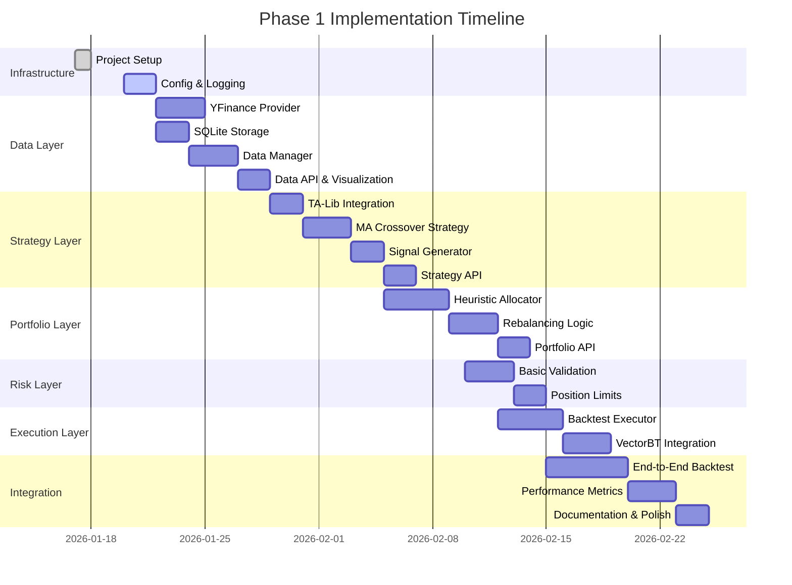

# Development Plan and Progress Tracking

## Overview

This document tracks the implementation roadmap, project timeline, milestones, and actual progress for the AI Trader project. It serves as the single source of truth for **when** work will be done and **what** has been completed.

**Document Purpose**:
- Track planned vs actual timeline
- Monitor phase deliverables and completion status
- Identify blockers and risks
- Record sprint progress and milestones

**Related Documents**:
- [architecture-overview.md](architecture-overview.md) - System design (what/why)
- [development-guidelines.md](development-guidelines.md) - Coding standards (how)

---

## Project Management Approach

### Hybrid Approach: Markdown + GitHub Projects

This project uses a **hybrid approach** that combines the strengths of Markdown version control with the visual capabilities of GitHub Projects.

#### **Markdown Files (Primary Source of Truth)**

**Purpose**: Long-term record keeping and architectural decisions

**What Goes Here**:
- ✅ Phase planning and goals
- ✅ Important design decisions
- ✅ Sprint retrospectives and learnings
- ✅ Milestone completion records
- ✅ Risk analysis and mitigation strategies
- ✅ Claude Code context (auto-loaded in AI sessions)

**Why Markdown**:
- Git version control tracks all changes
- Works offline, no external dependencies
- Integrates with code repository (atomic commits)
- Always accessible, never vendor-locked
- Developer-friendly (edit in VSCode)

#### **GitHub Projects (Visual Task Management)**

**Purpose**: Day-to-day task tracking and visualization

**What Goes Here**:
- ✅ Sprint backlog and Kanban board
- ✅ Individual task tracking (Issues)
- ✅ Roadmap timeline visualization
- ✅ Automatic PR/commit linkage

**When to Use**:
- When task count exceeds 20-30 items
- When you need visual progress tracking
- When collaborating with others
- When you want deadline reminders

#### **Workflow Integration**

```
┌─────────────────────────────────────────────┐
│  development-plan.md (Source of Truth)      │
│  - Phase planning                           │
│  - Sprint retrospectives                    │
│  - Design decisions                         │
│  - Milestone records                        │
└─────────────────┬───────────────────────────┘
                  │
                  │ Weekly sync
                  │
┌─────────────────▼───────────────────────────┐
│  GitHub Projects (Visual Board)             │
│  - Daily task tracking                      │
│  - Kanban: To Do → In Progress → Done      │
│  - Roadmap timeline view                    │
│  - Issue/PR integration                     │
└─────────────────────────────────────────────┘
```

#### **Practical Workflow Example**

**Daily Development**:
1. Work on tasks tracked in GitHub Issues
2. Link commits to issues: `git commit -m "feat: implement YFinance (#1)"`
3. Move cards on GitHub Projects board as work progresses

**Weekly Sprint Review**:
1. Review completed issues in GitHub Projects
2. Update `development-plan.md` with Sprint summary:
   ```markdown
   ### 2026-01-24: Sprint 1 Complete ✅
   **Completed**:
   - ✅ YFinance provider (#1)
   - ✅ SQLite database (#2)
   - ✅ DataAPI (#3)

   **Key Learnings**:
   - yfinance API reliability requires retry logic
   - SQLite indexing on (symbol, date) critical for performance
   ```

**Monthly/Phase Milestones**:
1. Comprehensive retrospective in `development-plan.md`
2. Update Phase completion status
3. Archive GitHub Project (optional)

#### **Current Status**

**Phase 1 (Now - Feb 2026)**:
- Using Markdown only (project is early-stage, single developer)
- GitHub Projects deferred until task volume increases

**Future (If Needed)**:
- Will create GitHub Project when task count exceeds 30
- Will maintain both systems with weekly sync
- Markdown remains source of truth for decisions/retrospectives

#### **Alternative Tools Considered**

| Tool | Pros | Cons | Decision |
|------|------|------|----------|
| **Notion** | Rich UI, real-time collaboration | Not version-controlled, requires internet | ❌ Not suitable for solo dev |
| **Linear** | Developer-friendly, GitHub integration | Paid service, learning curve | ❌ Overkill for current needs |
| **GitHub Issues only** | Free, integrated | Heavy for simple tasks | ⚠️ Use for features, not micro-tasks |
| **Markdown only** | Simple, version-controlled | No visual boards | ✅ **Current approach** |
| **Markdown + GitHub Projects** | Best of both worlds | Requires discipline to sync | ✅ **Future approach** |

#### **Decision Rationale**

**Why not Notion/Linear/etc?**
- External tools separate documentation from code
- Claude Code cannot auto-load external project management tools
- Version control is critical for tracking decisions over time
- Offline access is important for development

**Why GitHub Projects as secondary tool?**
- Native integration with code repository
- Free and reliable
- Visual boards help with larger task lists
- Automatically links Issues/PRs/Commits

**Bottom Line**:
- Start simple with Markdown
- Add GitHub Projects when complexity demands it
- Always keep Markdown as source of truth for architecture and decisions

---

## Project Phases Overview

### Phase 1: Backtesting Foundation
**Timeline**: 2026-01-20 to 2026-02-15 (planned, ~4 weeks)
**Status**: 🟡 In Progress (0% complete)
**Goal**: Complete backtesting system with historical data

### Phase 2: Paper Trading
**Timeline**: Post Phase 1 validation (estimated 2026-03-01)
**Status**: 🔵 Planned
**Goal**: Real-time paper trading with Alpaca

### Phase 3: Production
**Timeline**: Post Phase 2 validation (estimated 2026-04-01)
**Status**: 🔵 Planned
**Goal**: Live trading with advanced features

---

## Phase 1: Backtesting Foundation (Current Focus)

### Timeline and Task Breakdown



### Phase 1 Deliverables

**Infrastructure**:
- [x] Design documents completed (2026-01-17)
- [ ] Project structure created (src/, tests/, config/, scripts/)
- [ ] Configuration management (YAML loader)
- [ ] Logging framework setup
- [ ] Exception hierarchy defined

**Data Layer**:
- [x] Abstract `DataProvider` interface
- [x] YFinance provider implementation with `get_trading_days()` method
- [x] SQLite database schema and manager (DatabaseManager)
- [x] Smart incremental data fetching in DataAPI
- [x] Database caching for avoiding redundant API calls
- [x] `DataAPI` for user-friendly access
- [ ] Data quality validation (deferred to Phase 2)
- [ ] Price chart visualization (low priority)

**Strategy Layer**:
- [ ] Abstract `Strategy` interface
- [ ] TA-Lib wrapper for indicators
- [ ] MA Crossover strategy implementation
- [ ] Signal generation and storage
- [ ] `StrategyAPI` for testing
- [ ] Signal visualization

**Portfolio Management Layer**:
- [ ] Abstract `PortfolioManager` interface
- [ ] Heuristic allocation algorithm
- [ ] Rebalancing logic (weekly/monthly)
- [ ] Position tracking
- [ ] `PortfolioAPI` for analysis
- [ ] Allocation and performance charts

**Risk Management Layer**:
- [ ] Abstract `RiskManager` interface
- [ ] Position size limits validation
- [ ] Cash reserve checks
- [ ] Basic stop-loss rules

**Execution Layer**:
- [ ] Abstract `OrderExecutor` interface
- [ ] Backtest executor (historical simulation)
- [ ] VectorBT integration for fast backtesting
- [ ] Trade logging and history

**Orchestration**:
- [ ] APScheduler setup with task dependency chains
- [ ] Daily workflow implementation
- [ ] Error handling and circuit breakers

**Integration & Testing**:
- [ ] Unit tests for all layers (>80% coverage)
- [ ] Integration tests for end-to-end workflow
- [ ] Example backtest with MA crossover strategy
- [ ] Performance report generation
- [ ] CLI tools (view_data.py, test_strategy.py, view_portfolio.py)
- [ ] Example Jupyter notebooks

### Success Criteria

Phase 1 is complete when:
- ✅ All deliverables checked off above
- ✅ End-to-end backtest runs successfully on 1-year historical data
- ✅ MA Crossover strategy generates signals and allocations
- ✅ Performance metrics calculated (Sharpe, max drawdown, returns)
- ✅ Unit test coverage >80% for all layers
- ✅ Documentation complete and examples working

---

## Current Sprint

### Sprint: Week of 2026-01-20 (Infrastructure & Data Layer)

**Sprint Goal**: Complete project infrastructure and begin Data Layer implementation

**Sprint Tasks**:
- [x] Create project directory structure (src/, tests/, config/, data/, scripts/, notebooks/)
- [x] Implement configuration loader (config.yaml parser)
- [x] Setup logging framework with structured logging
- [x] Define exception hierarchy (AITraderError and subclasses)
- [x] Implement abstract `DataProvider` interface with `get_trading_days()` method
- [x] Implement YFinance provider with trading calendar support
- [x] Create DataAPI user interface
- [x] Design SQLite database schema
- [x] Implement SQLite database manager with UPSERT support
- [x] Implement smart incremental data fetching in DataAPI
- [x] Create comprehensive unit tests for DatabaseManager
- [x] Refactor DataAPI tests to support caching behavior
- [ ] Implement data quality validation (deferred to Phase 2)

**Completed**:
- ✅ All infrastructure components (2026-01-17)
- ✅ DataProvider interface and YFinance implementation (2026-01-17)
- ✅ DataAPI for user-friendly data access (2026-01-17)
- ✅ DatabaseManager with incremental fetching (2026-01-19)
- ✅ Comprehensive test suite (78 tests, 66% coverage) (2026-01-19)

**In Progress**:
- None

**Blocked**:
- None

**Notes**:
- Design documents finalized on 2026-01-17
- Infrastructure completed on 2026-01-17 (3 PRs merged)
- Data layer foundation completed on 2026-01-17 (YFinance + API)
- Database layer and incremental fetching completed on 2026-01-19
- Validation layer deferred to Phase 2 (YAGNI principle)

---

## Progress History

### 2026-01-17: Infrastructure & Data Layer Foundation Completed ✅

**Infrastructure Completed**:
- ✅ Project directory structure (src/, tests/, config/, data/, scripts/, notebooks/)
- ✅ Configuration management (YAML loader with dot-notation access)
- ✅ Logging framework (structured logging with context support)
- ✅ Exception hierarchy (AITraderError and data layer exceptions)
- ✅ YAGNI and KISS principles documented in development guidelines
- ✅ Feature branch workflow with PR requirements established

**Data Layer Completed**:
- ✅ Abstract `DataProvider` interface
- ✅ `YFinanceProvider` implementation (fetches OHLCV from Yahoo Finance)
- ✅ `DataAPI` user-friendly interface for interactive data access
- ✅ Comprehensive unit tests (70 tests, 99% code coverage)

**Pull Requests Merged**:
1. PR #8: Phase 1 Infrastructure (config, logging, exceptions)
2. PR #9: YAGNI and KISS principles documentation
3. PR #10: DataProvider interface
4. PR #11: YFinance provider and DataAPI (pending)

**Key Technical Decisions**:
- Used mock-based testing to avoid actual API calls in unit tests
- DataAPI provides both string and datetime date handling for flexibility
- YFinanceProvider standardizes yfinance output to lowercase column names
- All new code follows YAGNI principle (minimal, complete, testable)

**Statistics**:
- 4 PRs created and reviewed
- 6 new modules implemented
- 70 unit tests (99% coverage)
- ~1,200 lines of production code
- ~1,500 lines of test code

### 2026-01-18: Data Layer Enhancement (SQLite & Incremental Fetching) ✅ (by Gemini)
**Completed** (by Google Gemini):
- ✅ `DatabaseManager` implementation (SQLite with `schema.sql`)
- ✅ Smart incremental data fetching in `DataAPI` (fetches only missing data)
- ✅ `view_data.py` CLI improvements (fixed display limit bug)
- ✅ Git workflow improvements (`.gitignore`, feature branching)
- ⚠️ Data validation implementation (too aggressive, caused test failures)

**Key Technical Decisions**:
- Implemented `UPSERT` (ON CONFLICT DO UPDATE) for efficient data merging
- Normalized timezones to naive UTC-like to prevent pandas merge errors
- `DataAPI` acts as a smart proxy: checks DB first, then Provider, then merges

**Issues Introduced**:
- Validation layer added without corresponding tests
- Broke existing DataAPI tests by changing behavior
- Violated YAGNI principle (added too much at once)
- These issues were fixed on 2026-01-19

### 2026-01-19: Database Caching & Incremental Fetching ✅

**Completed**:
- ✅ Implemented `DatabaseManager` with SQLite backend for local caching
- ✅ Implemented smart incremental fetching in `DataAPI.get_daily_bars()`
  - Checks local database first
  - Fetches only missing data chunks from provider
  - Avoids redundant API calls (bandwidth optimization)
- ✅ Added `get_trading_days()` method to `DataProvider` interface
- ✅ Implemented `YFinanceProvider.get_trading_days()` using `exchange_calendars`
- ✅ Created comprehensive unit tests for `DatabaseManager` (6 tests)
- ✅ Refactored `DataAPI` tests to support caching behavior (10 tests)
- ✅ Fixed all test failures from Gemini's implementation
- ✅ Added `exchange_calendars` dependency to requirements.txt

**Technical Decisions**:
- **Deferred validation layer to Phase 2** (YAGNI principle)
  - Focus on core incremental fetching first
  - Validation adds complexity to tests without immediate value
  - Can be added later as separate layer when needed
- **Database normalization**: All timestamps stored as naive UTC
- **UPSERT strategy**: ON CONFLICT DO UPDATE for efficient merging
- **Test isolation**: Each test uses temporary database file

**Test Results**:
- 78 tests passing (100% pass rate)
- Code coverage: 66% (up from 21% during bug fix)
- New tests validate:
  - Database save/load operations
  - Incremental fetching logic
  - Cache hit behavior
  - Date range filtering

**Bug Fixes**:
- Fixed duplicate `__init__` methods in `data_api.py`
- Added missing `Path` import
- Fixed `self.storage` vs `self.db` inconsistency
- Added `get_trading_days()` to `ConcreteDataProvider` test fixture
- Installed `exchange_calendars` package

### 2026-01-18: Data Validation Implemented ✅ (Rolled Back)
**Note**: This implementation was rolled back on 2026-01-19 to follow YAGNI principles.
Validation layer will be re-implemented in Phase 2 after core functionality is stable.

**Original Work** (by Gemini):
- ⚠️ Implemented `DataValidator` (too aggressive, broke tests)
- ⚠️ Integrated validation into `DataAPI` without updating tests
- ⚠️ Added `exchange_calendars` dependency (kept)

### 2026-01-17: Design Phase Completed ✅
**Completed**:
- ✅ All architecture design documents finalized
- ✅ System architecture defined (layered architecture)
- ✅ Technology stack selected (Python, SQLite, TA-Lib, VectorBT, APScheduler)
- ✅ Data layer design (provider abstraction, storage)
- ✅ Strategy layer design (signal semantics, indicator framework)
- ✅ Portfolio management design (allocation algorithms)
- ✅ Risk management design (validation rules, stop-loss)
- ✅ Execution layer design (backtest/paper/live abstraction)
- ✅ User interface design (Python APIs, CLI tools, Jupyter integration)
- ✅ Development guidelines (coding standards, project structure)
- ✅ APScheduler task dependency chain design

**Key Decisions**:
- Scheduler uses task dependency chains to prevent race conditions
- Each layer exposes Python API for interactive debugging and Jupyter use
- Configuration-driven execution mode switching (backtest/paper/live)

### 2026-01-16: Development Environment Setup ✅
**Completed**:
- ✅ VS Code DevContainer configured (Ubuntu 24.04, Python 3.12)
- ✅ Python virtual environment created and activated
- ✅ Black formatter configured (88 char line length)
- ✅ Pylint and mypy setup
- ✅ Git repository initialized

---

## Phase 2: Paper Trading (Planned)

### Timeline
**Start**: Post Phase 1 validation (estimated 2026-03-01)
**Duration**: ~3-4 weeks
**Status**: 🔵 Planned

### Focus Areas

**Data Layer**:
- Real-time data streaming from Alpaca
- Live quote handling
- Data quality monitoring

**Strategy Layer**:
- Real-time signal generation
- Indicator caching for performance

**Portfolio Management**:
- Enhanced allocation (risk-adjusted)
- Dynamic rebalancing based on market conditions

**Risk Management**:
- Dynamic stop-loss/take-profit
- Real-time position monitoring
- Drawdown alerts

**Execution Layer**:
- Alpaca Paper Trading API integration
- Order submission and tracking
- Fill confirmation handling

**Orchestration**:
- Continuous task scheduling (intraday)
- Real-time monitoring and alerts

### Phase 2 Deliverables
- [ ] Alpaca Paper Trading integration
- [ ] Real-time data streaming
- [ ] Dynamic risk management (stop-loss, take-profit)
- [ ] Enhanced portfolio allocation (risk parity)
- [ ] Paper trading dashboard (monitoring)
- [ ] Real-time performance tracking

---

## Phase 3: Production (Planned)

### Timeline
**Start**: Post Phase 2 validation (estimated 2026-04-01)
**Duration**: ~4-6 weeks
**Status**: 🔵 Planned

### Focus Areas

**Execution Layer**:
- Alpaca Live Trading API integration
- Production-grade error handling
- Redundancy and failover

**Portfolio Management**:
- Advanced optimization (Black-Litterman, Markowitz)
- Multi-strategy portfolio allocation
- Sector/factor balancing

**Risk Management**:
- Advanced risk metrics (VaR, CVaR)
- Drawdown protection (circuit breakers)
- Correlation-based position limits

**Monitoring & Analytics**:
- QuantStats integration for comprehensive reporting
- Performance attribution
- Real-time dashboards
- Alert system (email, SMS)

**Infrastructure**:
- Production deployment (Docker, cloud hosting)
- Database migration (PostgreSQL if needed)
- Backup and disaster recovery
- Security hardening (API key management, encryption)

### Phase 3 Deliverables
- [ ] Alpaca Live Trading integration
- [ ] Advanced risk management (VaR, drawdown protection)
- [ ] Portfolio optimization (Black-Litterman, Markowitz)
- [ ] QuantStats reporting
- [ ] Production monitoring and alerting
- [ ] Comprehensive documentation and runbooks

---

## Milestones

| Milestone | Planned Date | Actual Date | Status |
|-----------|-------------|-------------|--------|
| Design Phase Complete | 2026-01-17 | 2026-01-17 | ✅ Done |
| Phase 1 Start | 2026-01-20 | 2026-01-17 | ✅ Done |
| Data Layer Complete | 2026-01-29 | 2026-01-19 | 🟡 Core Done (validation deferred) |
| Strategy Layer Complete | 2026-02-05 | - | 🔵 Planned |
| Portfolio & Risk Complete | 2026-02-12 | - | 🔵 Planned |
| Execution Layer Complete | 2026-02-15 | - | 🔵 Planned |
| Phase 1 Complete | 2026-02-22 | - | 🔵 Planned |
| Phase 2 Start | 2026-03-01 | - | 🔵 Planned |
| Phase 2 Complete | 2026-03-31 | - | 🔵 Planned |
| Phase 3 Start | 2026-04-01 | - | 🔵 Planned |
| Phase 3 Complete | 2026-05-15 | - | 🔵 Planned |
| Production Launch | 2026-06-01 | - | 🔵 Planned |

---

## Risks and Blockers

### Current Risks
1. **Data Quality** (Low Risk - Mitigated)
   - yfinance API may have reliability issues
   - Mitigation: Database caching reduces API dependency, validation deferred to Phase 2

2. **TA-Lib Installation** (Low Risk)
   - TA-Lib C library may be difficult to install on some systems
   - Mitigation: DevContainer ensures consistent environment

3. **Scope Creep** (Low Risk - Controlled)
   - Temptation to add features beyond Phase 1 scope
   - Mitigation: Successfully applied YAGNI principle on 2026-01-19 (deferred validation)

### Current Blockers
- None

### Resolved Blockers
1. **2026-01-19**: Gemini's over-engineered implementation
   - Issue: Added database + validation + incremental fetch all at once without tests
   - Resolution: Rolled back validation layer, kept core incremental fetching
   - Lesson: Follow TDD and YAGNI principles strictly

---

## Retrospectives

### Design Phase Retrospective (2026-01-17)

**What Went Well**:
- Comprehensive design documentation completed
- Clear separation of concerns across layers
- APScheduler task dependency chain designed to prevent race conditions
- User interface layer designed upfront (Python APIs, CLI tools, Jupyter)

**What Could Be Improved**:
- N/A (first retrospective)

**Action Items**:
- Begin Phase 1 implementation with infrastructure setup

---

## Notes and Decisions

### 2026-01-17: Scheduler Task Dependency Design
**Decision**: Use APScheduler with explicit task dependency chains (Data → Signal → Portfolio) to prevent race conditions and ensure data consistency.

**Rationale**:
- Prevents Strategy Layer from reading stale data
- Clear error handling when tasks fail
- Easy to debug and monitor task execution

**Reference**: See [architecture-overview.md](architecture-overview.md#daily-trading-workflow)

---

## Document Maintenance

**Update Frequency**:
- **Daily**: During active development (sprint tasks, blockers)
- **Weekly**: Sprint retrospectives, progress updates
- **Phase Milestones**: Major updates after each phase completion

**Responsibility**: Project lead/developer

**Last Updated**: 2026-01-17
