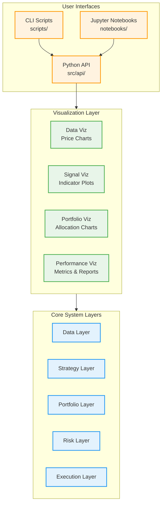

# User Interface and Developer Experience Design

## Overview

This document defines the user interface layer and developer experience for the AI Trader system. The goal is to provide **intuitive, Python-friendly interfaces** for:
- **Development and debugging** - Interactive exploration of each layer
- **Data analysis** - Jupyter Notebook integration for research
- **Visualization** - Charts and reports for signals, portfolios, performance
- **Manual operations** - CLI tools for common tasks

## Design Principles

1. **Layer-by-Layer Access**: Each layer exposes a clean Python API
2. **Notebook-First**: All APIs work seamlessly in Jupyter Notebooks
3. **Progressive Disclosure**: Simple tasks are simple, complex tasks are possible
4. **Visualization Built-In**: Every layer provides visualization helpers
5. **Interactive Shell**: Full REPL support for debugging and exploration

## Architecture



## Python API Layer (`src/api/`)

### 1. Data API (`src/api/data_api.py`)

**Purpose**: User-friendly interface to data layer

```python
# src/api/data_api.py

from typing import List, Optional
import pandas as pd
from datetime import datetime, timedelta

class DataAPI:
    """User-friendly API for market data access."""

    def __init__(self, config_path: str = "config/config.yaml"):
        """Initialize with configuration."""
        self.config = load_config()
        self.provider = create_data_provider(self.config)
        self.storage = DatabaseManager(self.config["data"]["db_path"])

    def get_prices(
        self,
        symbols: List[str],
        start: Optional[datetime] = None,
        end: Optional[datetime] = None,
        days: Optional[int] = None
    ) -> pd.DataFrame:
        """
        Get historical prices with flexible date specification.

        Args:
            symbols: List of stock symbols
            start: Start date (optional if using days)
            end: End date (defaults to today)
            days: Number of days back from end (alternative to start)

        Returns:
            DataFrame with OHLCV data

        Example:
            >>> data_api = DataAPI()
            >>> # Get last 30 days
            >>> prices = data_api.get_prices(["AAPL", "MSFT"], days=30)
            >>> # Get specific date range
            >>> prices = data_api.get_prices(
            ...     ["AAPL"],
            ...     start=datetime(2023, 1, 1),
            ...     end=datetime(2023, 12, 31)
            ... )
        """
        if end is None:
            end = datetime.now()
        if start is None and days:
            start = end - timedelta(days=days)

        return self.storage.get_prices(symbols, start, end)

    def plot_prices(
        self,
        symbols: List[str],
        days: int = 90,
        include_volume: bool = True
    ):
        """
        Plot price charts for symbols.

        Args:
            symbols: List of symbols to plot
            days: Number of days to show
            include_volume: Whether to include volume subplot

        Example:
            >>> data_api.plot_prices(["AAPL", "MSFT"], days=90)
        """
        from src.visualization.charts import plot_price_chart

        prices = self.get_prices(symbols, days=days)
        plot_price_chart(prices, include_volume=include_volume)

    def data_quality_report(self, symbols: List[str], days: int = 252):
        """
        Generate data quality report.

        Returns:
            DataFrame with missing data stats, gaps, etc.

        Example:
            >>> report = data_api.data_quality_report(["AAPL", "MSFT"])
            >>> print(report)
        """
        from src.visualization.reports import generate_data_quality_report

        prices = self.get_prices(symbols, days=days)
        return generate_data_quality_report(prices)

    def update_data(self, symbols: Optional[List[str]] = None):
        """
        Manually trigger data update.

        Args:
            symbols: Symbols to update (defaults to config universe)

        Example:
            >>> data_api.update_data()  # Update all configured symbols
            >>> data_api.update_data(["AAPL"])  # Update specific symbol
        """
        if symbols is None:
            symbols = self.config["strategy"]["parameters"]["universe"]

        data = self.provider.get_historical_bars(
            symbols,
            start=datetime.now() - timedelta(days=1),
            end=datetime.now()
        )
        self.storage.store_prices(data)
        print(f"Updated {len(symbols)} symbols")
```

### 2. Strategy API (`src/api/strategy_api.py`)

```python
# src/api/strategy_api.py

class StrategyAPI:
    """User-friendly API for strategy development and testing."""

    def __init__(self, config_path: str = "config/config.yaml"):
        self.config = load_config()
        self.data_api = DataAPI(config_path)

    def get_signals(
        self,
        symbols: Optional[List[str]] = None,
        date: Optional[datetime] = None
    ) -> pd.DataFrame:
        """
        Get latest signals or historical signals for a date.

        Args:
            symbols: List of symbols (defaults to universe)
            date: Specific date (defaults to latest)

        Returns:
            DataFrame with columns: [symbol, signal, date, strategy]

        Example:
            >>> strategy_api = StrategyAPI()
            >>> signals = strategy_api.get_signals()
            >>> print(signals)
        """
        storage = DatabaseManager(self.config["data"]["db_path"])
        return storage.get_signals(symbols, date)

    def generate_signals(
        self,
        strategy_name: str = "ma_crossover",
        symbols: Optional[List[str]] = None,
        **strategy_params
    ) -> Dict[str, float]:
        """
        Generate signals using specified strategy.

        Args:
            strategy_name: Strategy type (ma_crossover, momentum, etc.)
            symbols: Symbols to generate signals for
            **strategy_params: Strategy-specific parameters

        Returns:
            Dict mapping symbol to signal strength

        Example:
            >>> signals = strategy_api.generate_signals(
            ...     "ma_crossover",
            ...     symbols=["AAPL", "MSFT"],
            ...     fast_period=50,
            ...     slow_period=200
            ... )
        """
        strategy = create_strategy(strategy_name, **strategy_params)
        prices = self.data_api.get_prices(symbols or self.config["strategy"]["parameters"]["universe"])
        return strategy.generate_signals(prices)

    def plot_signals(
        self,
        symbol: str,
        days: int = 90,
        strategy_name: str = "ma_crossover",
        **strategy_params
    ):
        """
        Plot price chart with signals and indicators.

        Args:
            symbol: Symbol to plot
            days: Number of days to show
            strategy_name: Strategy to use
            **strategy_params: Strategy parameters

        Example:
            >>> strategy_api.plot_signals("AAPL", days=180, fast_period=50)
        """
        from src.visualization.charts import plot_strategy_signals

        prices = self.data_api.get_prices([symbol], days=days)
        strategy = create_strategy(strategy_name, **strategy_params)
        signals = strategy.generate_signals(prices)

        plot_strategy_signals(prices, signals, strategy)

    def backtest_strategy(
        self,
        strategy_name: str,
        start_date: datetime,
        end_date: datetime,
        initial_capital: float = 100000.0,
        **strategy_params
    ) -> pd.DataFrame:
        """
        Run quick backtest of strategy.

        Args:
            strategy_name: Strategy type
            start_date: Backtest start
            end_date: Backtest end
            initial_capital: Starting portfolio value
            **strategy_params: Strategy parameters

        Returns:
            DataFrame with backtest results

        Example:
            >>> results = strategy_api.backtest_strategy(
            ...     "ma_crossover",
            ...     start_date=datetime(2023, 1, 1),
            ...     end_date=datetime(2023, 12, 31),
            ...     fast_period=50,
            ...     slow_period=200
            ... )
            >>> print(results["total_return"])
        """
        from src.execution.backtest_executor import BacktestExecutor

        strategy = create_strategy(strategy_name, **strategy_params)
        executor = BacktestExecutor(initial_capital=initial_capital)

        # Run backtest
        results = executor.run(strategy, start_date, end_date)
        return results
```

### 3. Portfolio API (`src/api/portfolio_api.py`)

```python
# src/api/portfolio_api.py

class PortfolioAPI:
    """User-friendly API for portfolio analysis."""

    def __init__(self, config_path: str = "config/config.yaml"):
        self.config = load_config()
        self.storage = DatabaseManager(self.config["data"]["db_path"])

    def get_positions(self, date: Optional[datetime] = None) -> pd.DataFrame:
        """
        Get current or historical positions.

        Returns:
            DataFrame with columns: [symbol, shares, market_value, weight]

        Example:
            >>> portfolio_api = PortfolioAPI()
            >>> positions = portfolio_api.get_positions()
            >>> print(positions)
        """
        return self.storage.get_positions(date)

    def get_allocation(self, date: Optional[datetime] = None) -> pd.DataFrame:
        """
        Get portfolio allocation breakdown.

        Returns:
            DataFrame with position weights and allocations

        Example:
            >>> allocation = portfolio_api.get_allocation()
            >>> allocation.plot(kind='pie', y='weight')
        """
        positions = self.get_positions(date)
        total_value = positions["market_value"].sum()
        positions["weight"] = positions["market_value"] / total_value
        return positions[["symbol", "shares", "market_value", "weight"]]

    def plot_allocation(self, date: Optional[datetime] = None):
        """
        Plot portfolio allocation pie chart.

        Example:
            >>> portfolio_api.plot_allocation()
        """
        from src.visualization.charts import plot_portfolio_allocation

        allocation = self.get_allocation(date)
        plot_portfolio_allocation(allocation)

    def get_performance(
        self,
        start_date: Optional[datetime] = None,
        end_date: Optional[datetime] = None
    ) -> pd.DataFrame:
        """
        Get portfolio performance metrics.

        Returns:
            DataFrame with daily returns, cumulative returns, drawdown

        Example:
            >>> perf = portfolio_api.get_performance()
            >>> print(f"Total Return: {perf['cumulative_return'].iloc[-1]:.2%}")
        """
        return self.storage.get_portfolio_performance(start_date, end_date)

    def plot_performance(self, days: int = 252):
        """
        Plot portfolio performance charts.

        Shows equity curve, drawdown, returns distribution.

        Example:
            >>> portfolio_api.plot_performance(days=90)
        """
        from src.visualization.charts import plot_portfolio_performance

        perf = self.get_performance()
        plot_portfolio_performance(perf[-days:])
```

## CLI Scripts (`scripts/`)

### 1. Data Viewer (`scripts/view_data.py`)

```python
#!/usr/bin/env python3
"""Interactive data viewer CLI."""

import click
from datetime import datetime, timedelta
from src.api.data_api import DataAPI

@click.group()
def cli():
    """AI Trader Data Viewer"""
    pass

@cli.command()
@click.argument("symbols", nargs=-1, required=True)
@click.option("--days", default=30, help="Number of days to show")
@click.option("--plot/--no-plot", default=True, help="Show price chart")
def prices(symbols, days, plot):
    """View price data for symbols."""
    data_api = DataAPI()
    prices = data_api.get_prices(list(symbols), days=days)

    click.echo(prices.tail(10))

    if plot:
        data_api.plot_prices(list(symbols), days=days)

@cli.command()
@click.argument("symbols", nargs=-1)
def quality(symbols):
    """Check data quality for symbols."""
    data_api = DataAPI()
    report = data_api.data_quality_report(list(symbols))
    click.echo(report)

@cli.command()
@click.argument("symbols", nargs=-1)
def update(symbols):
    """Update market data."""
    data_api = DataAPI()
    data_api.update_data(list(symbols) if symbols else None)
    click.echo("✓ Data updated successfully")

if __name__ == "__main__":
    cli()
```

**Usage**:
```bash
# View prices for AAPL
python scripts/view_data.py prices AAPL --days 90

# Check data quality
python scripts/view_data.py quality AAPL MSFT GOOGL

# Update data
python scripts/view_data.py update
```

### 2. Strategy Tester (`scripts/test_strategy.py`)

```python
#!/usr/bin/env python3
"""Interactive strategy testing CLI."""

import click
from datetime import datetime
from src.api.strategy_api import StrategyAPI

@click.group()
def cli():
    """AI Trader Strategy Tester"""
    pass

@cli.command()
@click.option("--strategy", default="ma_crossover", help="Strategy name")
@click.option("--symbols", multiple=True, help="Symbols to test")
def signals(strategy, symbols):
    """Generate and view current signals."""
    strategy_api = StrategyAPI()
    signals = strategy_api.generate_signals(strategy, symbols=list(symbols) if symbols else None)

    for symbol, signal in signals.items():
        emoji = "🟢" if signal > 0.5 else "🔴" if signal < -0.5 else "⚪"
        click.echo(f"{emoji} {symbol}: {signal:+.2f}")

@cli.command()
@click.argument("symbol")
@click.option("--strategy", default="ma_crossover")
@click.option("--days", default=180)
def plot(symbol, strategy, days):
    """Plot strategy signals for a symbol."""
    strategy_api = StrategyAPI()
    strategy_api.plot_signals(symbol, days=days, strategy_name=strategy)

@cli.command()
@click.option("--strategy", default="ma_crossover")
@click.option("--start", required=True, help="Start date YYYY-MM-DD")
@click.option("--end", required=True, help="End date YYYY-MM-DD")
def backtest(strategy, start, end):
    """Run strategy backtest."""
    strategy_api = StrategyAPI()

    start_date = datetime.strptime(start, "%Y-%m-%d")
    end_date = datetime.strptime(end, "%Y-%m-%d")

    results = strategy_api.backtest_strategy(strategy, start_date, end_date)

    click.echo(f"\nBacktest Results:")
    click.echo(f"Total Return: {results['total_return']:.2%}")
    click.echo(f"Sharpe Ratio: {results['sharpe_ratio']:.2f}")
    click.echo(f"Max Drawdown: {results['max_drawdown']:.2%}")

if __name__ == "__main__":
    cli()
```

**Usage**:
```bash
# View current signals
python scripts/test_strategy.py signals --strategy ma_crossover

# Plot signals for AAPL
python scripts/test_strategy.py plot AAPL --days 180

# Run backtest
python scripts/test_strategy.py backtest --start 2023-01-01 --end 2023-12-31
```

### 3. Portfolio Viewer (`scripts/view_portfolio.py`)

```python
#!/usr/bin/env python3
"""Portfolio viewer CLI."""

import click
from src.api.portfolio_api import PortfolioAPI

@click.group()
def cli():
    """AI Trader Portfolio Viewer"""
    pass

@cli.command()
def positions():
    """View current positions."""
    portfolio_api = PortfolioAPI()
    positions = portfolio_api.get_positions()

    click.echo("\nCurrent Positions:")
    click.echo(positions.to_string(index=False))

@cli.command()
def allocation():
    """View portfolio allocation."""
    portfolio_api = PortfolioAPI()
    allocation = portfolio_api.get_allocation()

    click.echo("\nPortfolio Allocation:")
    for _, row in allocation.iterrows():
        bar = "█" * int(row["weight"] * 50)
        click.echo(f"{row['symbol']:6s} {bar} {row['weight']:.1%}")

@cli.command()
@click.option("--days", default=90)
@click.option("--plot/--no-plot", default=True)
def performance(days, plot):
    """View portfolio performance."""
    portfolio_api = PortfolioAPI()
    perf = portfolio_api.get_performance()[-days:]

    total_return = perf["cumulative_return"].iloc[-1]
    max_dd = perf["drawdown"].min()

    click.echo(f"\nPerformance (Last {days} days):")
    click.echo(f"Total Return: {total_return:.2%}")
    click.echo(f"Max Drawdown: {max_dd:.2%}")

    if plot:
        portfolio_api.plot_performance(days=days)

if __name__ == "__main__":
    cli()
```

**Usage**:
```bash
# View positions
python scripts/view_portfolio.py positions

# View allocation
python scripts/view_portfolio.py allocation

# View performance
python scripts/view_portfolio.py performance --days 90
```

## Jupyter Notebook Integration

### Example Notebook: Data Exploration

```python
# notebooks/01_data_exploration.ipynb

# Cell 1: Setup
from src.api.data_api import DataAPI
import matplotlib.pyplot as plt

data_api = DataAPI()

# Cell 2: Load and display price data
symbols = ["AAPL", "MSFT", "GOOGL"]
prices = data_api.get_prices(symbols, days=180)
prices.head()

# Cell 3: Plot prices
data_api.plot_prices(symbols, days=180)

# Cell 4: Data quality check
quality_report = data_api.data_quality_report(symbols)
quality_report

# Cell 5: Price statistics
prices.groupby("symbol")["close"].describe()
```

### Example Notebook: Strategy Development

```python
# notebooks/02_strategy_development.ipynb

# Cell 1: Setup
from src.api.strategy_api import StrategyAPI
from src.api.data_api import DataAPI

strategy_api = StrategyAPI()
data_api = DataAPI()

# Cell 2: Test MA Crossover with different parameters
for fast, slow in [(20, 50), (50, 200), (10, 30)]:
    signals = strategy_api.generate_signals(
        "ma_crossover",
        symbols=["AAPL"],
        fast_period=fast,
        slow_period=slow
    )
    print(f"MA({fast}/{slow}): {signals['AAPL']:+.2f}")

# Cell 3: Visualize signals
strategy_api.plot_signals(
    "AAPL",
    days=365,
    strategy_name="ma_crossover",
    fast_period=50,
    slow_period=200
)

# Cell 4: Quick backtest
from datetime import datetime

results = strategy_api.backtest_strategy(
    "ma_crossover",
    start_date=datetime(2023, 1, 1),
    end_date=datetime(2023, 12, 31),
    fast_period=50,
    slow_period=200
)

print(f"Total Return: {results['total_return']:.2%}")
print(f"Sharpe Ratio: {results['sharpe_ratio']:.2f}")
```

## Visualization Module (`src/visualization/`)

### Chart Functions

```python
# src/visualization/charts.py

import matplotlib.pyplot as plt
import pandas as pd
from typing import Optional

def plot_price_chart(
    prices: pd.DataFrame,
    include_volume: bool = True
) -> None:
    """
    Plot OHLCV price chart.

    Args:
        prices: DataFrame with columns [symbol, date, open, high, low, close, volume]
        include_volume: Whether to include volume subplot
    """
    fig, axes = plt.subplots(
        2 if include_volume else 1,
        1,
        figsize=(14, 8 if include_volume else 6),
        sharex=True
    )

    ax_price = axes[0] if include_volume else axes

    # Plot prices by symbol
    for symbol in prices["symbol"].unique():
        symbol_data = prices[prices["symbol"] == symbol]
        ax_price.plot(symbol_data["date"], symbol_data["close"], label=symbol)

    ax_price.set_ylabel("Price ($)")
    ax_price.legend()
    ax_price.grid(True, alpha=0.3)

    if include_volume:
        for symbol in prices["symbol"].unique():
            symbol_data = prices[prices["symbol"] == symbol]
            axes[1].bar(
                symbol_data["date"],
                symbol_data["volume"],
                label=symbol,
                alpha=0.6
            )
        axes[1].set_ylabel("Volume")
        axes[1].set_xlabel("Date")
        axes[1].legend()
        axes[1].grid(True, alpha=0.3)

    plt.tight_layout()
    plt.show()

def plot_strategy_signals(
    prices: pd.DataFrame,
    signals: Dict[str, float],
    strategy
) -> None:
    """Plot price chart with strategy indicators and signals."""
    # Implementation with indicator overlays
    pass

def plot_portfolio_allocation(allocation: pd.DataFrame) -> None:
    """Plot portfolio allocation as pie chart and bar chart."""
    fig, (ax1, ax2) = plt.subplots(1, 2, figsize=(14, 6))

    # Pie chart
    ax1.pie(
        allocation["weight"],
        labels=allocation["symbol"],
        autopct="%1.1f%%",
        startangle=90
    )
    ax1.set_title("Portfolio Allocation")

    # Bar chart
    ax2.barh(allocation["symbol"], allocation["weight"])
    ax2.set_xlabel("Weight")
    ax2.set_title("Position Weights")
    ax2.grid(True, alpha=0.3, axis="x")

    plt.tight_layout()
    plt.show()

def plot_portfolio_performance(performance: pd.DataFrame) -> None:
    """Plot portfolio performance metrics."""
    fig, axes = plt.subplots(3, 1, figsize=(14, 10), sharex=True)

    # Equity curve
    axes[0].plot(performance["date"], performance["portfolio_value"])
    axes[0].set_ylabel("Portfolio Value ($)")
    axes[0].set_title("Equity Curve")
    axes[0].grid(True, alpha=0.3)

    # Drawdown
    axes[1].fill_between(
        performance["date"],
        0,
        performance["drawdown"] * 100,
        color="red",
        alpha=0.3
    )
    axes[1].set_ylabel("Drawdown (%)")
    axes[1].set_title("Drawdown")
    axes[1].grid(True, alpha=0.3)

    # Daily returns
    axes[2].bar(performance["date"], performance["daily_return"] * 100, alpha=0.6)
    axes[2].set_ylabel("Daily Return (%)")
    axes[2].set_xlabel("Date")
    axes[2].set_title("Daily Returns")
    axes[2].grid(True, alpha=0.3)

    plt.tight_layout()
    plt.show()
```

## Interactive Python Shell

### IPython Integration

```python
# scripts/shell.py
"""Interactive Python shell with AI Trader context loaded."""

from IPython import embed
from src.api.data_api import DataAPI
from src.api.strategy_api import StrategyAPI
from src.api.portfolio_api import PortfolioAPI

# Pre-load APIs
data = DataAPI()
strategy = StrategyAPI()
portfolio = PortfolioAPI()

banner = """
AI Trader Interactive Shell
===========================

Available objects:
  data      - DataAPI instance
  strategy  - StrategyAPI instance
  portfolio - PortfolioAPI instance

Examples:
  prices = data.get_prices(["AAPL"], days=90)
  signals = strategy.get_signals()
  positions = portfolio.get_positions()

Type 'help(data)' for more info.
"""

embed(banner1=banner)
```

**Usage**:
```bash
python scripts/shell.py

# Interactive session:
>>> prices = data.get_prices(["AAPL"], days=30)
>>> data.plot_prices(["AAPL", "MSFT"], days=90)
>>> signals = strategy.generate_signals("ma_crossover")
>>> print(signals)
```

## Updated Project Structure

```
ai-trader/
├── src/
│   ├── api/                    # NEW: User-friendly Python APIs
│   │   ├── __init__.py
│   │   ├── data_api.py         # Data access API
│   │   ├── strategy_api.py     # Strategy testing API
│   │   └── portfolio_api.py    # Portfolio analysis API
│   │
│   ├── visualization/          # NEW: Visualization module
│   │   ├── __init__.py
│   │   ├── charts.py           # Plotting functions
│   │   └── reports.py          # Report generation
│   │
│   ├── data/                   # (existing)
│   ├── strategy/               # (existing)
│   ├── portfolio/              # (existing)
│   ├── risk/                   # (existing)
│   └── execution/              # (existing)
│
├── scripts/                    # CLI tools
│   ├── view_data.py            # Data viewer CLI
│   ├── test_strategy.py        # Strategy tester CLI
│   ├── view_portfolio.py       # Portfolio viewer CLI
│   ├── shell.py                # Interactive shell
│   ├── backtest.py             # (existing)
│   └── paper_trade.py          # (existing)
│
├── notebooks/                  # Jupyter notebooks
│   ├── 01_data_exploration.ipynb
│   ├── 02_strategy_development.ipynb
│   ├── 03_portfolio_analysis.ipynb
│   └── 04_backtest_analysis.ipynb
│
└── (rest of project structure)
```

## Benefits

1. **Developer Productivity**:
   - No need to write boilerplate database queries
   - Quick experimentation in Jupyter Notebooks
   - Fast debugging with CLI tools

2. **Debugging & Development**:
   - Inspect data at each layer
   - Test strategies without full system integration
   - Visualize intermediate results

3. **Research & Analysis**:
   - Explore data interactively
   - Rapid strategy prototyping
   - Performance analysis and visualization

4. **Usability**:
   - Python-friendly, pandas-compatible
   - Works in any environment (notebook, script, REPL)
   - Progressive disclosure (simple things simple)

## Implementation Priority

### Phase 1 (Minimum Viable)
- [x] `DataAPI` - basic price access and plotting
- [x] `view_data.py` CLI tool
- [x] Basic price chart visualization

### Phase 2 (Strategy Development)
- [ ] `StrategyAPI` - signal generation and backtesting
- [ ] `test_strategy.py` CLI tool
- [ ] Strategy signal visualization

### Phase 3 (Portfolio Analysis)
- [ ] `PortfolioAPI` - position and performance access
- [ ] `view_portfolio.py` CLI tool
- [ ] Portfolio visualization (allocation, performance)

### Phase 4 (Enhanced Experience)
- [ ] Interactive shell (`shell.py`)
- [ ] Example Jupyter notebooks
- [ ] Report generation (PDF/HTML)

## Related Documents

- [architecture-overview.md](architecture-overview.md) - System architecture
- [development-guidelines.md](development-guidelines.md) - Coding standards
- [data-layer-design.md](data-layer-design.md) - Data layer details
- [strategy-layer-design.md](strategy-layer-design.md) - Strategy layer details
